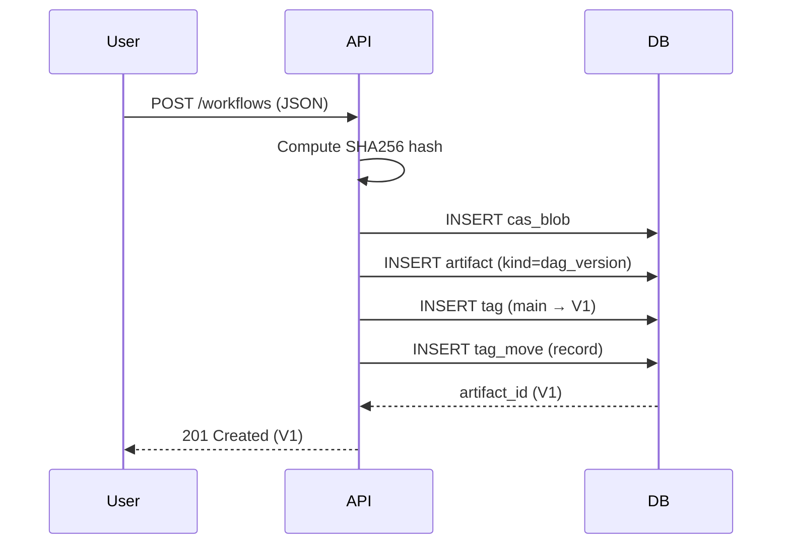
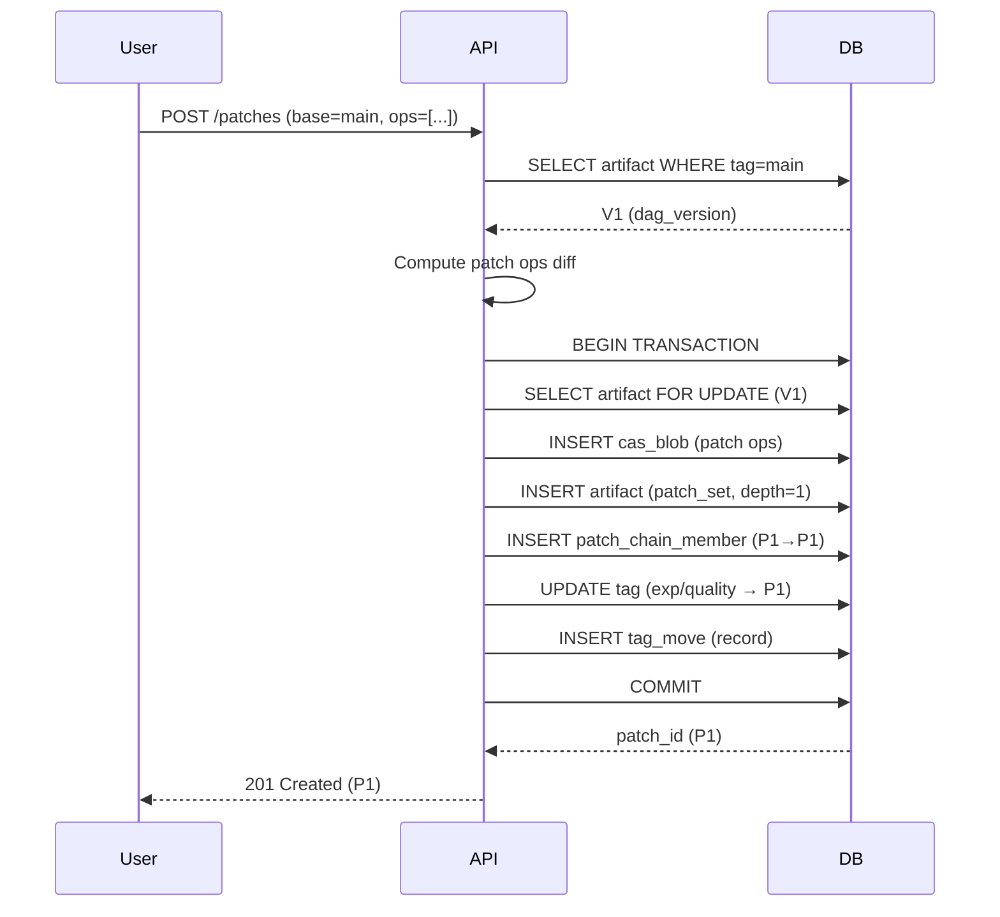
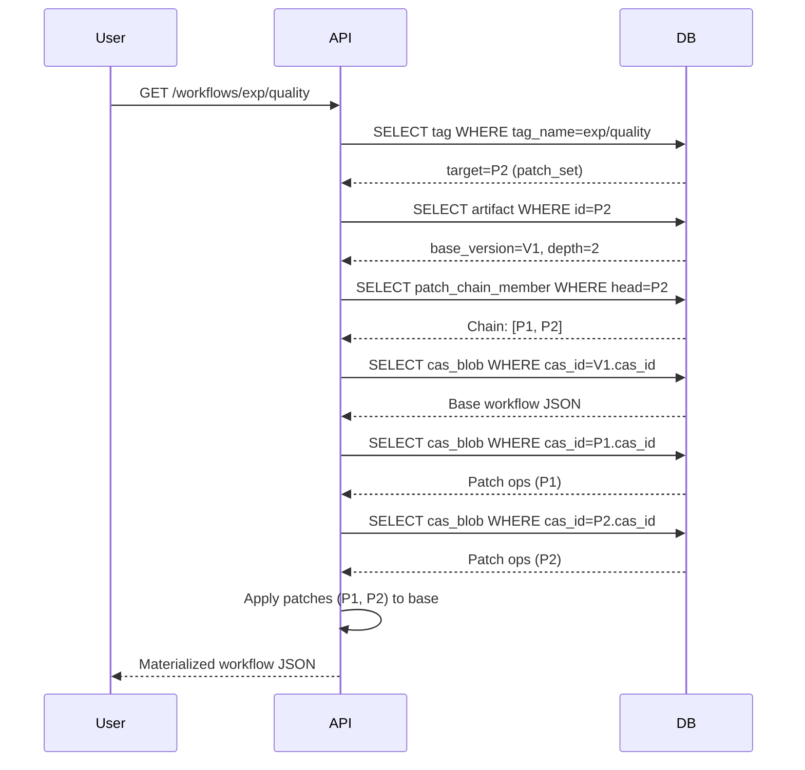
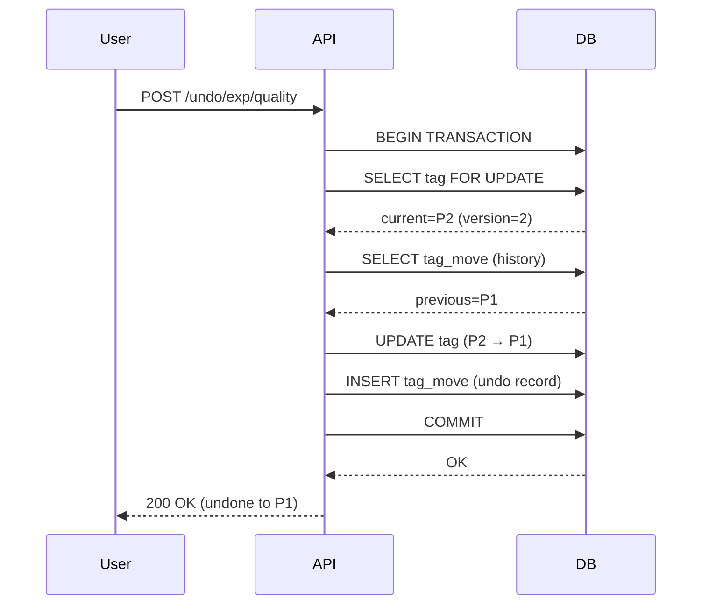

so # Complete Workflow Lifecycle Flow

This document shows the complete flow of creating workflows, adding patches, fetching, and undo/redo operations.

---

## Overview: Tables Touched

| Operation | Tables Modified | Tables Queried |
|-----------|----------------|----------------|
| **Create Workflow** | `cas_blob`, `artifact`, `tag`, `tag_move` | None (initial) |
| **Create Patch** | `cas_blob`, `artifact`, `patch_chain_member`, `tag`, `tag_move` | `artifact` (parent), `patch_chain_member` (parent chain) |
| **Fetch/Resolve** | None (read-only) | `tag`, `artifact`, `patch_chain_member`, `cas_blob` |
| **Undo** | `tag`, `tag_move` | `tag`, `tag_move` |
| **Redo** | `tag`, `tag_move` | `tag`, `tag_move` |
| **Submit Run** | `cas_blob`, `artifact`, `run`, `run_snapshot_index` | `tag`, `artifact`, `patch_chain_member` |

---

## Flow 1: Create Initial Workflow

### Scenario
User creates a new workflow "Lead Processing v1.0" with 5 nodes and 4 edges.

### Tables Touched
```
cas_blob → artifact → tag → tag_move
```

### Step-by-Step Flow



### SQL Operations

```sql
-- Transaction 1: Create Base Workflow
BEGIN;

-- 1️⃣ Store workflow JSON in CAS
INSERT INTO cas_blob (
    cas_id,                    -- sha256:abc123...
    media_type,                -- 'application/json;type=dag'
    size_bytes,                -- 2048
    content                    -- Workflow JSON as bytea
)
VALUES (
    'sha256:abc123...',
    'application/json;type=dag',
    2048,
    '{"nodes":[...], "edges":[...]}'::bytea
);

-- 2️⃣ Create artifact entry
INSERT INTO artifact (
    artifact_id,               -- UUID v7 (auto)
    kind,                      -- 'dag_version'
    cas_id,                    -- sha256:abc123...
    name,                      -- 'Lead Processing v1.0'
    version_hash,              -- sha256:vh_def456...
    nodes_count,               -- 5
    edges_count,               -- 4
    created_by                 -- 'user@example.com'
)
VALUES (
    uuid_generate_v7(),
    'dag_version',
    'sha256:abc123...',
    'Lead Processing v1.0',
    'sha256:vh_def456...',
    5,
    4,
    'user@example.com'
)
RETURNING artifact_id;  -- Returns: V1_id

-- Store: V1_id = '018d3f6d-8b4a-7890-b123-456789abcdef'

-- 3️⃣ Create/update 'main' tag
INSERT INTO tag (
    tag_name,                  -- 'main'
    target_kind,               -- 'dag_version'
    target_id,                 -- V1_id
    target_hash,               -- sha256:vh_def456...
    moved_by                   -- 'user@example.com'
)
VALUES (
    'main',
    'dag_version',
    '018d3f6d-8b4a-7890-b123-456789abcdef',
    'sha256:vh_def456...',
    'user@example.com'
)
ON CONFLICT (tag_name) DO UPDATE SET
    target_kind = EXCLUDED.target_kind,
    target_id = EXCLUDED.target_id,
    target_hash = EXCLUDED.target_hash,
    version = tag.version + 1,
    moved_by = EXCLUDED.moved_by,
    moved_at = now();

-- 4️⃣ Record tag movement (for undo/redo)
INSERT INTO tag_move (
    tag_name,                  -- 'main'
    from_kind,                 -- NULL (first move)
    from_id,                   -- NULL
    to_kind,                   -- 'dag_version'
    to_id,                     -- V1_id
    moved_by                   -- 'user@example.com'
)
VALUES (
    'main',
    NULL,
    NULL,
    'dag_version',
    '018d3f6d-8b4a-7890-b123-456789abcdef',
    'user@example.com'
);

COMMIT;
```

### Result State

```
cas_blob:
  sha256:abc123... → Workflow JSON (2048 bytes)

artifact:
  V1 (018d3f6d-...) → kind=dag_version, cas=sha256:abc123...

tag:
  main → dag_version:V1 (version=1)

tag_move:
  id=1: main (NULL → dag_version:V1)
```

---

## Flow 2: Create First Patch (Depth=1)

### Scenario
User adds a new node "validate_email" to workflow on branch `exp/quality`.

### Tables Touched
```
artifact (parent query) → cas_blob → artifact → patch_chain_member → tag → tag_move
```

### Step-by-Step Flow



### SQL Operations

```sql
-- Transaction 2: Create First Patch
BEGIN;

-- 1️⃣ Lock parent artifact (V1)
SELECT artifact_id, kind, base_version, depth, version_hash
FROM artifact
WHERE artifact_id = '018d3f6d-8b4a-7890-b123-456789abcdef'  -- V1
FOR UPDATE;

-- Returns: kind='dag_version', base_version=NULL, depth=NULL

-- 2️⃣ Store patch operations in CAS
INSERT INTO cas_blob (
    cas_id,                    -- sha256:patch_xyz...
    media_type,                -- 'application/json;type=patch_ops'
    size_bytes,                -- 512
    content                    -- Patch ops as bytea
)
VALUES (
    'sha256:patch_xyz...',
    'application/json;type=patch_ops',
    512,
    '[{"op":"add","path":"/nodes/-","value":{"id":"validate_email",...}}]'::bytea
);

-- 3️⃣ Create patch artifact
INSERT INTO artifact (
    artifact_id,               -- UUID v7 (auto)
    kind,                      -- 'patch_set'
    cas_id,                    -- sha256:patch_xyz...
    name,                      -- 'Add validate_email node'
    base_version,              -- V1 (parent is dag_version)
    depth,                     -- 1 (first patch)
    op_count,                  -- 1
    created_by                 -- 'user@example.com'
)
VALUES (
    uuid_generate_v7(),
    'patch_set',
    'sha256:patch_xyz...',
    'Add validate_email node',
    '018d3f6d-8b4a-7890-b123-456789abcdef',  -- V1
    1,
    1,
    'user@example.com'
)
RETURNING artifact_id;  -- Returns: P1_id

-- Store: P1_id = '018d3f6d-9c5b-7890-c234-567890bcdefg'

-- 4️⃣ Create patch chain (P1 → [P1])
INSERT INTO patch_chain_member (
    head_id,                   -- P1 (this patch)
    seq,                       -- 1 (first in chain)
    member_id                  -- P1 (points to self)
)
VALUES (
    '018d3f6d-9c5b-7890-c234-567890bcdefg',  -- P1
    1,
    '018d3f6d-9c5b-7890-c234-567890bcdefg'   -- P1
);

-- 5️⃣ Create/move 'exp/quality' tag
INSERT INTO tag (
    tag_name,                  -- 'exp/quality'
    target_kind,               -- 'patch_set'
    target_id,                 -- P1_id
    moved_by                   -- 'user@example.com'
)
VALUES (
    'exp/quality',
    'patch_set',
    '018d3f6d-9c5b-7890-c234-567890bcdefg',
    'user@example.com'
)
ON CONFLICT (tag_name) DO UPDATE SET
    target_kind = EXCLUDED.target_kind,
    target_id = EXCLUDED.target_id,
    version = tag.version + 1,
    moved_by = EXCLUDED.moved_by,
    moved_at = now();

-- 6️⃣ Record tag movement
INSERT INTO tag_move (
    tag_name,                  -- 'exp/quality'
    from_kind,                 -- 'dag_version' (or NULL if new branch)
    from_id,                   -- V1 (or NULL)
    to_kind,                   -- 'patch_set'
    to_id,                     -- P1_id
    moved_by                   -- 'user@example.com'
)
VALUES (
    'exp/quality',
    'dag_version',
    '018d3f6d-8b4a-7890-b123-456789abcdef',  -- V1
    'patch_set',
    '018d3f6d-9c5b-7890-c234-567890bcdefg',  -- P1
    'user@example.com'
);

COMMIT;
```

### Result State

```
cas_blob:
  sha256:abc123...    → Workflow JSON (V1)
  sha256:patch_xyz... → Patch ops (P1)

artifact:
  V1 → kind=dag_version
  P1 → kind=patch_set, base_version=V1, depth=1

patch_chain_member:
  (P1, seq=1) → P1

tag:
  main         → dag_version:V1 (version=1)
  exp/quality  → patch_set:P1 (version=1)

tag_move:
  id=1: main (NULL → V1)
  id=2: exp/quality (V1 → P1)
```

---

## Flow 3: Create Second Patch (Depth=2)

### Scenario
User adds another node "enrich_data" on top of P1.

### Tables Touched
```
artifact (query P1) → patch_chain_member (query P1 chain) → cas_blob → artifact → patch_chain_member (copy+append) → tag → tag_move
```

### SQL Operations

```sql
-- Transaction 3: Create Second Patch
BEGIN;

-- 1️⃣ Lock parent artifact (P1)
SELECT artifact_id, kind, base_version, depth, version_hash
FROM artifact
WHERE artifact_id = '018d3f6d-9c5b-7890-c234-567890bcdefg'  -- P1
FOR UPDATE;

-- Returns: kind='patch_set', base_version=V1, depth=1

-- 2️⃣ Store patch operations
INSERT INTO cas_blob (
    cas_id,                    -- sha256:patch_abc...
    media_type,                -- 'application/json;type=patch_ops'
    size_bytes,                -- 480
    content                    -- Patch ops
)
VALUES (
    'sha256:patch_abc...',
    'application/json;type=patch_ops',
    480,
    '[{"op":"add","path":"/nodes/-","value":{"id":"enrich_data",...}}]'::bytea
);

-- 3️⃣ Create patch artifact (depth=2)
INSERT INTO artifact (
    artifact_id,
    kind,
    cas_id,
    name,
    base_version,              -- V1 (same base)
    depth,                     -- 2 (parent.depth + 1)
    op_count,
    created_by
)
VALUES (
    uuid_generate_v7(),
    'patch_set',
    'sha256:patch_abc...',
    'Add enrich_data node',
    '018d3f6d-8b4a-7890-b123-456789abcdef',  -- V1
    2,
    1,
    'user@example.com'
)
RETURNING artifact_id;  -- Returns: P2_id

-- Store: P2_id = '018d3f6d-ad6c-7890-d345-678901cdefgh'

-- 4️⃣ Copy parent's chain (P1)
INSERT INTO patch_chain_member (head_id, seq, member_id)
SELECT
    '018d3f6d-ad6c-7890-d345-678901cdefgh' AS head_id,  -- P2 (new head)
    seq,
    member_id
FROM patch_chain_member
WHERE head_id = '018d3f6d-9c5b-7890-c234-567890bcdefg';  -- P1 (parent)

-- Inserts: (P2, seq=1) → P1

-- 5️⃣ Append new patch to chain
INSERT INTO patch_chain_member (
    head_id,
    seq,
    member_id
)
VALUES (
    '018d3f6d-ad6c-7890-d345-678901cdefgh',  -- P2
    2,                                        -- MAX(seq) + 1
    '018d3f6d-ad6c-7890-d345-678901cdefgh'   -- P2
);

-- 6️⃣ Move tag (with optimistic locking)
UPDATE tag
SET
    target_kind = 'patch_set',
    target_id = '018d3f6d-ad6c-7890-d345-678901cdefgh',  -- P2
    version = version + 1,
    moved_by = 'user@example.com',
    moved_at = now()
WHERE tag_name = 'exp/quality'
  AND target_id = '018d3f6d-9c5b-7890-c234-567890bcdefg'  -- P1 (CAS guard)
  AND version = 1;

-- Check: GET DIAGNOSTICS rows_updated = ROW_COUNT;
-- If rows_updated = 0 → ROLLBACK (conflict)

-- 7️⃣ Record tag movement
INSERT INTO tag_move (
    tag_name,
    from_kind,
    from_id,
    to_kind,
    to_id,
    moved_by
)
VALUES (
    'exp/quality',
    'patch_set',
    '018d3f6d-9c5b-7890-c234-567890bcdefg',  -- P1
    'patch_set',
    '018d3f6d-ad6c-7890-d345-678901cdefgh',  -- P2
    'user@example.com'
);

COMMIT;
```

### Result State

```
cas_blob:
  sha256:abc123...    → Workflow JSON (V1)
  sha256:patch_xyz... → Patch ops (P1)
  sha256:patch_abc... → Patch ops (P2)

artifact:
  V1 → kind=dag_version
  P1 → kind=patch_set, base_version=V1, depth=1
  P2 → kind=patch_set, base_version=V1, depth=2

patch_chain_member:
  (P1, seq=1) → P1
  (P2, seq=1) → P1  ← Copied from P1
  (P2, seq=2) → P2  ← Appended

tag:
  main         → dag_version:V1 (version=1)
  exp/quality  → patch_set:P2 (version=2)

tag_move:
  id=1: main (NULL → V1)
  id=2: exp/quality (V1 → P1)
  id=3: exp/quality (P1 → P2)
```

---

## Flow 4: Fetch/Resolve Workflow

### Scenario
User wants to fetch the current state of `exp/quality` branch.

### Tables Touched (Read-Only)
```
tag → artifact → patch_chain_member → cas_blob
```

### Step-by-Step Flow



### SQL Operations

```sql
-- Read Transaction: Resolve exp/quality
BEGIN;

-- 1️⃣ Resolve tag to artifact
SELECT
    t.target_kind,
    t.target_id,
    t.target_hash,
    a.base_version,
    a.depth,
    a.version_hash
FROM tag t
JOIN artifact a ON a.artifact_id = t.target_id
WHERE t.tag_name = 'exp/quality';

-- Returns:
--   target_kind='patch_set'
--   target_id=P2
--   base_version=V1
--   depth=2

-- 2️⃣ Get patch chain (O(1) lookup!)
SELECT seq, member_id
FROM patch_chain_member
WHERE head_id = '018d3f6d-ad6c-7890-d345-678901cdefgh'  -- P2
ORDER BY seq ASC;

-- Returns:
--   seq=1 → member_id=P1
--   seq=2 → member_id=P2

-- 3️⃣ Load base workflow
SELECT content
FROM cas_blob
WHERE cas_id = (
    SELECT cas_id
    FROM artifact
    WHERE artifact_id = '018d3f6d-8b4a-7890-b123-456789abcdef'  -- V1
);

-- Returns: Base workflow JSON

-- 4️⃣ Load patch operations (in order)
SELECT a.artifact_id, c.content
FROM artifact a
JOIN cas_blob c ON c.cas_id = a.cas_id
WHERE a.artifact_id IN (
    '018d3f6d-9c5b-7890-c234-567890bcdefg',  -- P1
    '018d3f6d-ad6c-7890-d345-678901cdefgh'   -- P2
)
ORDER BY a.depth ASC;  -- Implicit order via depth

-- Returns:
--   P1 → Patch ops JSON
--   P2 → Patch ops JSON

COMMIT;
```

### Application-Side Materialization

```javascript
// Pseudo-code
function materialize(baseWorkflow, patches) {
    let current = JSON.parse(baseWorkflow);

    for (const patch of patches) {
        const ops = JSON.parse(patch.content);
        current = applyJSONPatch(current, ops);
    }

    return current;
}

// Result:
// - Base workflow: 5 nodes, 4 edges
// - + P1: add validate_email node → 6 nodes
// - + P2: add enrich_data node → 7 nodes
// Final: 7 nodes, 6 edges
```

---

## Flow 5: Undo (Move Tag Backward)

### Scenario
User wants to undo the last change on `exp/quality` (P2 → P1).

### Tables Touched
```
tag (query current) → tag_move (query history) → tag (update) → tag_move (insert)
```

### Step-by-Step Flow



### SQL Operations

```sql
-- Transaction 4: Undo Last Change
BEGIN;

-- 1️⃣ Get current tag position (with lock)
SELECT target_id, target_kind, version
FROM tag
WHERE tag_name = 'exp/quality'
FOR UPDATE;

-- Returns: target_id=P2, target_kind='patch_set', version=2

-- 2️⃣ Find previous position from history
SELECT from_id, from_kind
FROM tag_move
WHERE tag_name = 'exp/quality'
  AND to_id = '018d3f6d-ad6c-7890-d345-678901cdefgh'  -- P2 (current)
ORDER BY moved_at DESC
LIMIT 1;

-- Returns: from_id=P1, from_kind='patch_set'

-- 3️⃣ Move tag backward
UPDATE tag
SET
    target_id = '018d3f6d-9c5b-7890-c234-567890bcdefg',  -- P1 (previous)
    target_kind = 'patch_set',
    version = version + 1,                              -- 3
    moved_by = 'user@example.com (undo)',
    moved_at = now()
WHERE tag_name = 'exp/quality'
  AND version = 2;  -- Optimistic lock

-- 4️⃣ Record undo in history
INSERT INTO tag_move (
    tag_name,
    from_kind,
    from_id,
    to_kind,
    to_id,
    moved_by
)
VALUES (
    'exp/quality',
    'patch_set',
    '018d3f6d-ad6c-7890-d345-678901cdefgh',  -- P2 (old)
    'patch_set',
    '018d3f6d-9c5b-7890-c234-567890bcdefg',  -- P1 (new)
    'user@example.com (undo)'
);

COMMIT;
```

### Result State

```
tag:
  exp/quality → patch_set:P1 (version=3)

tag_move:
  id=1: main (NULL → V1)
  id=2: exp/quality (V1 → P1)
  id=3: exp/quality (P1 → P2)
  id=4: exp/quality (P2 → P1) [UNDO]
```

---

## Flow 6: Redo (Move Tag Forward)

### Scenario
User wants to redo the last undo on `exp/quality` (P1 → P2).

### SQL Operations

```sql
-- Transaction 5: Redo Last Undo
BEGIN;

-- 1️⃣ Get current tag position
SELECT target_id, target_kind, version
FROM tag
WHERE tag_name = 'exp/quality'
FOR UPDATE;

-- Returns: target_id=P1, version=3

-- 2️⃣ Find next position from history
SELECT to_id, to_kind
FROM tag_move
WHERE tag_name = 'exp/quality'
  AND from_id = '018d3f6d-9c5b-7890-c234-567890bcdefg'  -- P1 (current)
ORDER BY moved_at ASC  -- Note: ASC (not DESC)
LIMIT 1;

-- Returns: to_id=P2, to_kind='patch_set'

-- 3️⃣ Move tag forward
UPDATE tag
SET
    target_id = '018d3f6d-ad6c-7890-d345-678901cdefgh',  -- P2 (next)
    target_kind = 'patch_set',
    version = version + 1,                              -- 4
    moved_by = 'user@example.com (redo)',
    moved_at = now()
WHERE tag_name = 'exp/quality'
  AND version = 3;

-- 4️⃣ Record redo in history
INSERT INTO tag_move (
    tag_name,
    from_kind,
    from_id,
    to_kind,
    to_id,
    moved_by
)
VALUES (
    'exp/quality',
    'patch_set',
    '018d3f6d-9c5b-7890-c234-567890bcdefg',  -- P1 (old)
    'patch_set',
    '018d3f6d-ad6c-7890-d345-678901cdefgh',  -- P2 (new)
    'user@example.com (redo)'
);

COMMIT;
```

### Result State

```
tag:
  exp/quality → patch_set:P2 (version=4)

tag_move:
  id=1: main (NULL → V1)
  id=2: exp/quality (V1 → P1)
  id=3: exp/quality (P1 → P2)
  id=4: exp/quality (P2 → P1) [UNDO]
  id=5: exp/quality (P1 → P2) [REDO]
```

---

## Summary: Data Flow Diagram

```
┌─────────────────────────────────────────────────────────────┐
│                      WORKFLOW LIFECYCLE                      │
└─────────────────────────────────────────────────────────────┘

1. CREATE WORKFLOW
   User → API: POST /workflows
          ↓
   cas_blob ← Store workflow JSON
          ↓
   artifact ← Create dag_version (V1)
          ↓
   tag ← Point 'main' → V1
          ↓
   tag_move ← Record: NULL → V1

2. CREATE PATCH (First)
   User → API: POST /patches (base=main)
          ↓
   artifact ← Query parent (V1, FOR UPDATE)
          ↓
   cas_blob ← Store patch ops
          ↓
   artifact ← Create patch_set (P1, depth=1, base=V1)
          ↓
   patch_chain_member ← Create chain: P1 → [P1]
          ↓
   tag ← Point 'exp/quality' → P1
          ↓
   tag_move ← Record: V1 → P1

3. CREATE PATCH (Second)
   User → API: POST /patches (base=exp/quality)
          ↓
   artifact ← Query parent (P1, FOR UPDATE)
   patch_chain_member ← Query P1 chain → [P1]
          ↓
   cas_blob ← Store patch ops
          ↓
   artifact ← Create patch_set (P2, depth=2, base=V1)
          ↓
   patch_chain_member ← Copy chain: P2 → [P1, P2]
          ↓
   tag ← Update 'exp/quality' → P2 (CAS: version++)
          ↓
   tag_move ← Record: P1 → P2

4. FETCH/RESOLVE
   User → API: GET /workflows/exp/quality
          ↓
   tag → artifact ← Resolve: exp/quality → P2
          ↓
   patch_chain_member ← Get chain: P2 → [P1, P2]
          ↓
   cas_blob ← Load V1 (base)
   cas_blob ← Load P1 (patch)
   cas_blob ← Load P2 (patch)
          ↓
   API ← Materialize: V1 + P1 + P2
          ↓
   User ← JSON (7 nodes, 6 edges)

5. UNDO
   User → API: POST /undo/exp/quality
          ↓
   tag ← Query current (P2, FOR UPDATE)
          ↓
   tag_move ← Query history: P2 ← from P1
          ↓
   tag ← Update: exp/quality → P1 (version++)
          ↓
   tag_move ← Record: P2 → P1 (undo)

6. REDO
   User → API: POST /redo/exp/quality
          ↓
   tag ← Query current (P1, FOR UPDATE)
          ↓
   tag_move ← Query history: P1 → to P2
          ↓
   tag ← Update: exp/quality → P2 (version++)
          ↓
   tag_move ← Record: P1 → P2 (redo)
```

---

## Key Insights

### 1. Immutability
- **Never modified**: `cas_blob`, `artifact`, `patch_chain_member` (except cascades)
- **Only tags move**: `tag` is the only mutable pointer

### 2. O(1) Chain Resolution
```sql
-- Fast: Pre-materialized chain
SELECT member_id FROM patch_chain_member WHERE head_id = P2 ORDER BY seq;
-- Returns: [P1, P2] in 1-2ms

-- Slow: Recursive traversal (avoided!)
WITH RECURSIVE chain AS (...) -- Not needed!
```

### 3. Copy-on-Write Chain
- **Depth=1**: 1 row in `patch_chain_member`
- **Depth=10**: 10 rows per head (acceptable)
- **Depth=20**: Trigger compaction

### 4. Undo/Redo via Tag History
```sql
-- Undo: Look backward in tag_move
SELECT from_id FROM tag_move WHERE to_id = current ORDER BY moved_at DESC LIMIT 1;

-- Redo: Look forward in tag_move
SELECT to_id FROM tag_move WHERE from_id = current ORDER BY moved_at ASC LIMIT 1;
```

### 5. Optimistic Locking Prevents Conflicts
```sql
UPDATE tag SET ... WHERE tag_name = 'exp/quality' AND version = expected_version;
-- If rowcount=0 → conflict → retry or fail
```

---

## Performance Characteristics

| Operation | Complexity | Latency | Tables Modified |
|-----------|------------|---------|-----------------|
| Create workflow | O(1) | 5-10ms | 4 (cas, artifact, tag, tag_move) |
| Create patch depth=N | O(N) | 10-50ms | 5 (cas, artifact, chain×N, tag, tag_move) |
| Fetch workflow | O(depth) | 5-20ms | 0 (read-only) |
| Undo | O(1) | 2-5ms | 2 (tag, tag_move) |
| Redo | O(1) | 2-5ms | 2 (tag, tag_move) |

---

**End of Workflow Lifecycle Flow**
